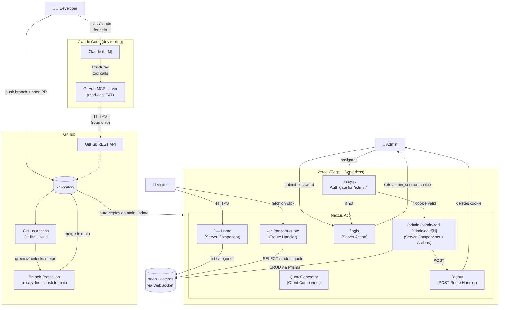
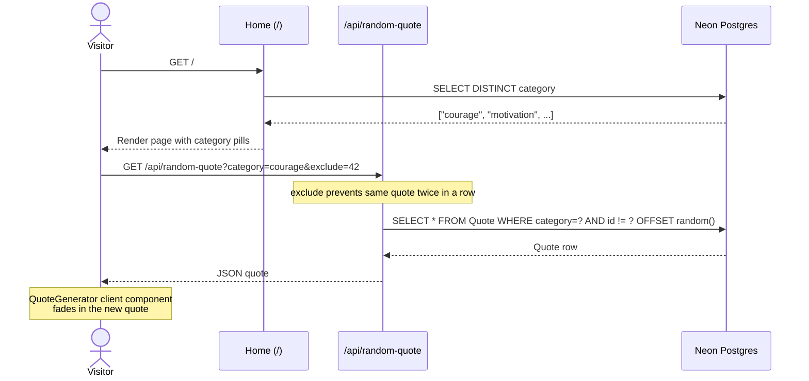
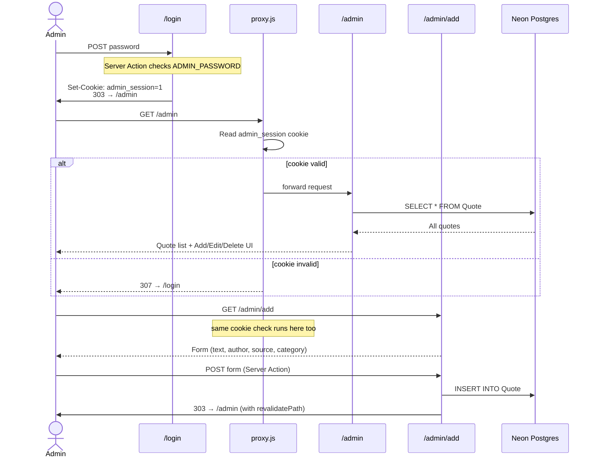
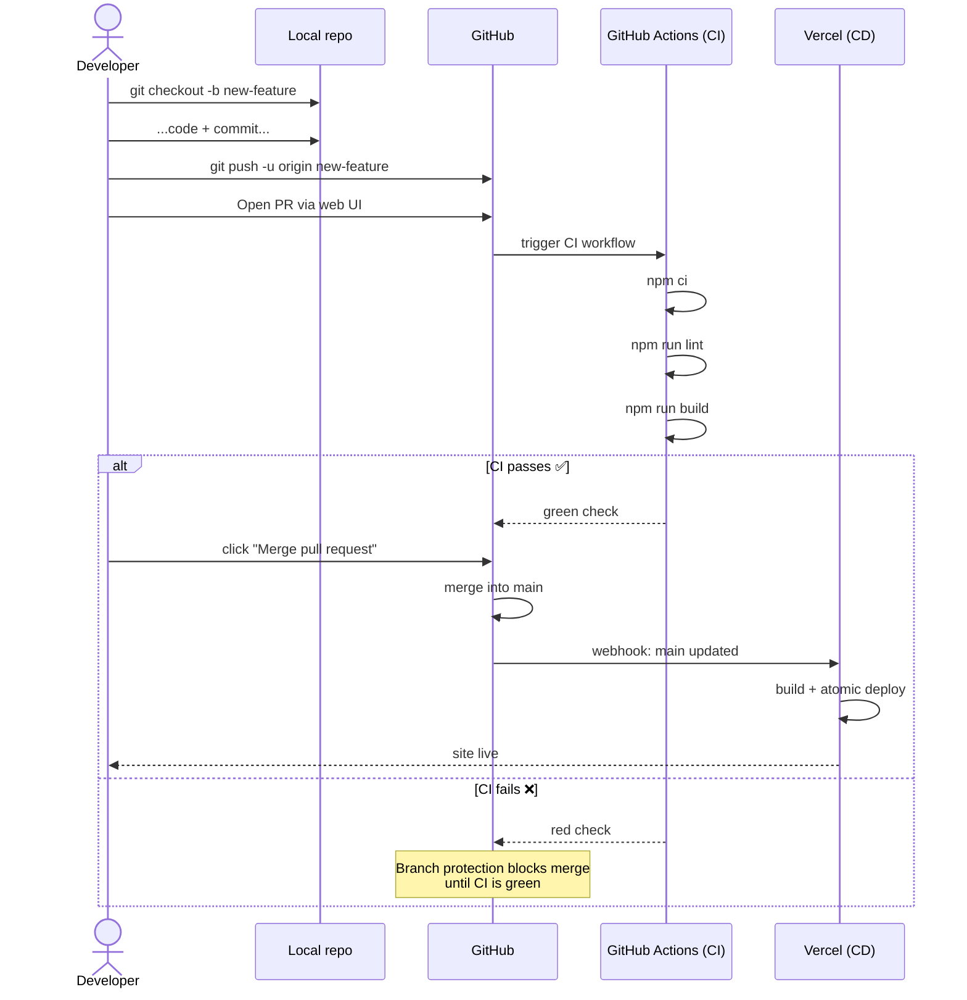
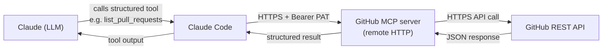

# Daily Dose — Architecture

A curated quotes web app. Visitors pick a category and click "Generate" to get a random uplifting quote. An admin panel manages the quote library.

## System overview



---

## Flow 1 — Visitor generates a quote



---

## Flow 2 — Admin login + manage quotes



---

## Flow 3 — CI/CD pipeline (from `git push` to live site)



**Split:** GitHub Actions handles **CI** (validation before merge); Vercel handles **CD** (deployment after merge). They don't conflict because they run at different times — CI on PRs, CD only when `main` is updated.

**Branch protection** ensures broken code never reaches `main`:
- Direct pushes to `main` are blocked
- PRs cannot be merged until the `check` job (lint + build) is green
- All changes must therefore go through PR → CI → merge → deploy

---

## MCP servers (agentic tooling)

Claude Code can talk to external systems through **MCP** (Model Context Protocol) servers. Each MCP server exposes a set of structured tools (typed functions) that Claude can call — cleaner than shelling out to CLI tools, with per-function permission control and reusability across MCP-compatible apps.

### Configured MCP servers

| Server | Endpoint | Purpose | Config scope |
|---|---|---|---|
| **GitHub MCP** | `https://api.githubcopilot.com/mcp/` (remote HTTP) | Structured access to GitHub APIs (PRs, issues, repo metadata) | Local — config in `~/.claude.json`, not committed |

### How the GitHub MCP is wired up



### Authentication — fine-grained PAT

A **GitHub fine-grained personal access token (PAT)** is used as a Bearer token by the MCP server. Scoped narrowly:

- **Repository:** only `daily-dose` (no other repos accessible)
- **Permissions (all read-only):**
  - Contents: Read
  - Issues: Read
  - Metadata: Read
  - Pull requests: Read
- **Expiration:** 90 days (rotated when expired)

The token lives in `~/.claude.json` on the local machine. It is never committed to the repo, and Claude Code never echoes the token back into the LLM context — even though the LLM can *use* the MCP tools, it never sees the raw token.

### Conservative read-only setup — defense in depth

The PAT itself enforces the safety boundary: **even if Claude attempts a write/delete operation through the MCP, GitHub will reject the API call** because the token lacks those scopes. This is a stronger guarantee than relying on Claude's good behavior or per-tool allow lists alone.

When write capability is genuinely needed (e.g., opening PRs via MCP), the plan is to **deliberately upgrade the PAT's scopes** with explicit human-in-the-loop consent — not auto-grant Claude broader access.

### Setup command (for reproducibility)

```bash
claude mcp add --transport http github https://api.githubcopilot.com/mcp/ \
  --header "Authorization: Bearer $GITHUB_MCP_TOKEN" \
  --scope local
```

The `$GITHUB_MCP_TOKEN` env var is set in the user's shell environment, not committed anywhere in the repo.

### Verification

```bash
claude mcp list           # should show "github: ✓ Connected"
```

Then inside Claude Code, `/mcp` shows connected servers and the tool count exposed by each one.

---

## Tech stack

| Layer | Choice | Why |
|---|---|---|
| **Framework** | Next.js 16 (App Router) | Server Components, Server Actions, Route Handlers, file-based routing |
| **UI** | React 19 + Tailwind CSS v4 | Component-driven, warm cream/ink palette via custom tokens |
| **Icons** | lucide-react | Lightweight icon set (BookOpen, Sparkles, LogOut, etc.) |
| **Database** | Neon Postgres (serverless) | Pay-as-you-go, hibernates when idle, WebSocket-based |
| **ORM** | Prisma 7 with `@prisma/adapter-neon` | Type-safe queries, serverless-friendly driver |
| **Auth** | Cookie-based admin session | Simple single-admin pattern: httpOnly `admin_session=1` cookie |
| **Hosting** | Vercel | Atomic zero-downtime deploys, auto-builds on `git push` |

---

## File map

```
daily-dose/
├── app/
│   ├── page.js                    ← Home (Server Component, fetches categories)
│   ├── QuoteGenerator.js          ← Client Component (generate button + quote display)
│   ├── layout.js                  ← Root layout, fonts, body styling
│   ├── globals.css                ← Tailwind theme tokens + quote-appear animation
│   │
│   ├── api/
│   │   └── random-quote/route.js  ← GET endpoint, returns random quote (with exclude support)
│   │
│   ├── login/page.js              ← Login form + Server Action setting cookie
│   ├── logout/route.js            ← POST Route Handler clearing cookie
│   │
│   └── admin/
│       ├── page.js                ← Quote list + Add/Edit/Delete actions
│       ├── add/page.js            ← Add quote form
│       ├── edit/[id]/page.js      ← Edit quote form
│       ├── CategoryPicker.js      ← Client: text input + clickable existing-category chips
│       ├── SubmitButton.js        ← Client: useFormStatus spinner for "Saving…" state
│       └── DeleteButton.js        ← Client: delete with confirm() dialog
│
├── lib/
│   └── prisma.js                  ← Prisma client singleton with Neon WebSocket adapter
│
├── prisma/
│   └── schema.prisma              ← Quote model (text, author?, source?, category, timestamps)
│
├── proxy.js                       ← Edge auth gate for /admin/* (Next.js 16 "middleware")
│
├── .github/
│   └── workflows/ci.yml           ← GitHub Actions CI — lint + build on every PR
│
└── .claude/skills/seed-quotes/    ← Claude Code skill — invoke /seed-quotes for curated quotes
```

---

## Key design decisions

1. **Generator UX over flat list** — visitors get one random quote at a time, building curiosity. The list view is admin-only.
2. **`secure + httpOnly` cookie** — admin session is HTTP-only (JS can't read it) and HTTPS-only in production.
3. **`force-dynamic` on admin pages** — prevents Vercel from caching auth-protected pages.
4. **POST for logout** — prevents Next.js Link prefetching from accidentally logging users out.
5. **Edge proxy for auth** — runs before any rendering or caching, the canonical Next.js 16 way to gate routes.
6. **Random by `OFFSET` + `exclude` param** — fine for small libraries; avoids same quote twice in a row.
7. **Categories stored as free-text strings** — no separate `Category` table needed; the home page derives the pills from `DISTINCT category` queries.
8. **CI on GitHub Actions, CD on Vercel** — clean split: validation gates before merge, atomic deploys after merge. Branch protection on `main` enforces the PR workflow so broken code never reaches production.

---

## Environment variables

| Variable | Where it's used | Required? |
|---|---|---|
| `DATABASE_URL` | `lib/prisma.js` — Neon connection string | ✅ Yes (locally + on Vercel) |
| `ADMIN_PASSWORD` | `app/login/page.js` — login check | ✅ Yes (locally + on Vercel) |
