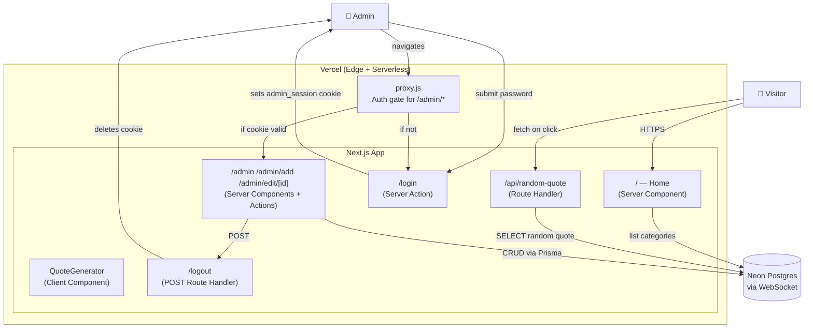
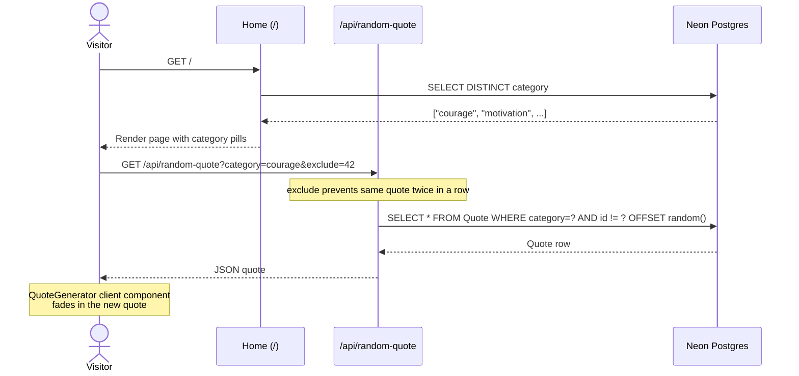
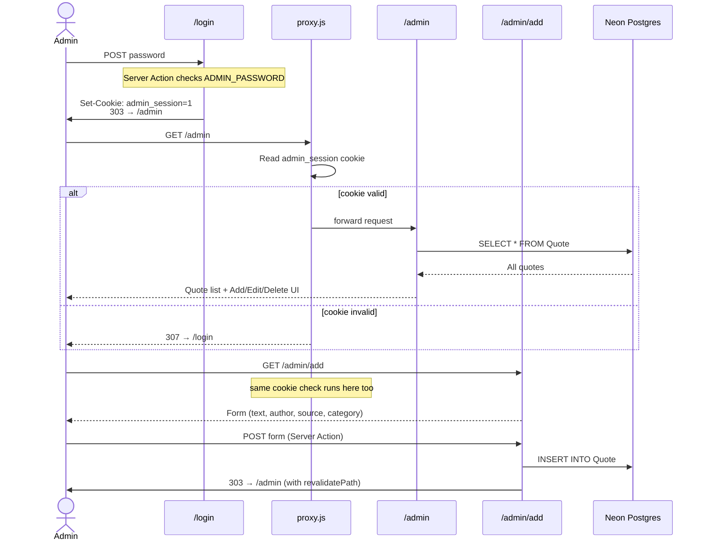

# Daily Dose — Architecture

A curated quotes web app. Visitors pick a category and click "Generate" to get a random uplifting quote. An admin panel manages the quote library.

## System overview



---

## Flow 1 — Visitor generates a quote



---

## Flow 2 — Admin login + manage quotes



---

## Tech stack

| Layer | Choice | Why |
|---|---|---|
| **Framework** | Next.js 16 (App Router) | Server Components, Server Actions, Route Handlers, file-based routing |
| **UI** | React 19 + Tailwind CSS v4 | Component-driven, warm cream/ink palette via custom tokens |
| **Icons** | lucide-react | Lightweight icon set (BookOpen, Sparkles, LogOut, etc.) |
| **Database** | Neon Postgres (serverless) | Pay-as-you-go, hibernates when idle, WebSocket-based |
| **ORM** | Prisma 7 with `@prisma/adapter-neon` | Type-safe queries, serverless-friendly driver |
| **Auth** | Cookie-based admin session | Simple single-admin pattern: httpOnly `admin_session=1` cookie |
| **Hosting** | Vercel | Atomic zero-downtime deploys, auto-builds on `git push` |

---

## File map

```
daily-dose/
├── app/
│   ├── page.js                    ← Home (Server Component, fetches categories)
│   ├── QuoteGenerator.js          ← Client Component (generate button + quote display)
│   ├── layout.js                  ← Root layout, fonts, body styling
│   ├── globals.css                ← Tailwind theme tokens + quote-appear animation
│   │
│   ├── api/
│   │   └── random-quote/route.js  ← GET endpoint, returns random quote (with exclude support)
│   │
│   ├── login/page.js              ← Login form + Server Action setting cookie
│   ├── logout/route.js            ← POST Route Handler clearing cookie
│   │
│   └── admin/
│       ├── page.js                ← Quote list + Add/Edit/Delete actions
│       ├── add/page.js            ← Add quote form
│       ├── edit/[id]/page.js      ← Edit quote form
│       ├── CategoryPicker.js      ← Client: text input + clickable existing-category chips
│       ├── SubmitButton.js        ← Client: useFormStatus spinner for "Saving…" state
│       └── DeleteButton.js        ← Client: delete with confirm() dialog
│
├── lib/
│   └── prisma.js                  ← Prisma client singleton with Neon WebSocket adapter
│
├── prisma/
│   └── schema.prisma              ← Quote model (text, author?, source?, category, timestamps)
│
├── proxy.js                       ← Edge auth gate for /admin/* (Next.js 16 "middleware")
│
└── .claude/skills/seed-quotes/    ← Claude Code skill — invoke /seed-quotes for curated quotes
```

---

## Key design decisions

1. **Generator UX over flat list** — visitors get one random quote at a time, building curiosity. The list view is admin-only.
2. **`secure + httpOnly` cookie** — admin session is HTTP-only (JS can't read it) and HTTPS-only in production.
3. **`force-dynamic` on admin pages** — prevents Vercel from caching auth-protected pages.
4. **POST for logout** — prevents Next.js Link prefetching from accidentally logging users out.
5. **Edge proxy for auth** — runs before any rendering or caching, the canonical Next.js 16 way to gate routes.
6. **Random by `OFFSET` + `exclude` param** — fine for small libraries; avoids same quote twice in a row.
7. **Categories stored as free-text strings** — no separate `Category` table needed; the home page derives the pills from `DISTINCT category` queries.

---

## Environment variables

| Variable | Where it's used | Required? |
|---|---|---|
| `DATABASE_URL` | `lib/prisma.js` — Neon connection string | ✅ Yes (locally + on Vercel) |
| `ADMIN_PASSWORD` | `app/login/page.js` — login check | ✅ Yes (locally + on Vercel) |
